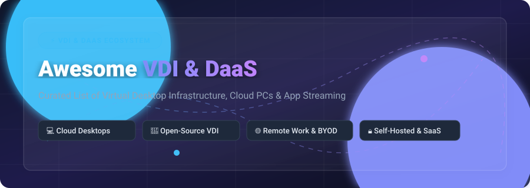
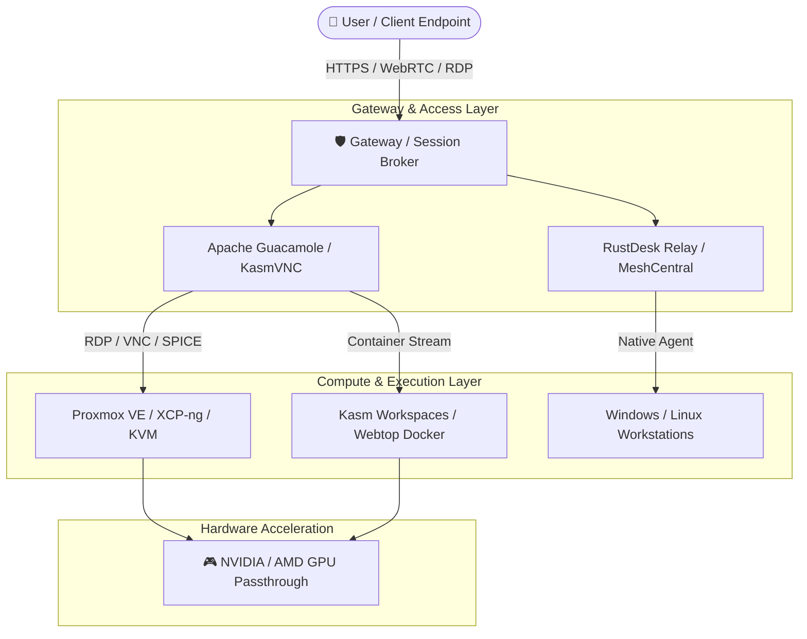

  

<h1 align="center">🖥️ Awesome Virtual Desktop Infrastructure (VDI) & DaaS</h1>

  
  
  
  
  
  

  <b>A curated catalog of commercial SaaS / DaaS products, self-hosted Virtual Desktop Infrastructure (VDI), containerized browser desktops, low-latency streaming solutions, and open-source remote access tools.</b>

  <i>Empowering IT administrators, DevOps engineers, and security teams with cloud PCs, BYOD enablement, and self-hosted desktop environments.</i>

---

## 📌 Table of Contents

- [🌐 SaaS & Managed DaaS Platforms](#-saas--managed-daas-platforms)
- [⚡ Open-Source GitHub Projects](#-open-source-github-projects)
- [🧩 VDI Architecture & Deployment Guide](#-vdi-architecture--deployment-guide)
- [🤝 How to Contribute](#-how-to-contribute)
- [💖 Support & Community](#-support--community)
- [⚠️ Disclaimer & Security Guidelines](#%EF%B8%8F-disclaimer--security-guidelines)
- [📈 Star History](#-star-history)

---

## 🌐 SaaS & Managed DaaS Platforms

> 📊 **Market Analysis & Industry Overview:**  
> The global **Virtual Desktop Infrastructure (VDI) & Desktop-as-a-Service (DaaS)** market is estimated at **$26.8 Billion (2026)** and projected to expand to **$65.2 Billion by 2032** at a CAGR of **15.8%**. The market exhibits a **moderately concentrated top tier** dominated by cloud hyperscalers (Microsoft & AWS) and legacy enterprise virtualization vendors (Citrix & VMware/Omnissa), while remaining **highly fragmented across niche enterprise, educational, and open-source containerized VDI alternatives** (such as Kasm, RustDesk, and Parallels RAS).

Below is a curated comparison of leading commercial DaaS and VDI offerings, sorted by parent company valuation / revenue (descending):

| 🚀 Product / Provider | 💰 Starting Pricing | 🎁 Free Tier / Trial Limits | 🏢 Company Valuation / Revenue | 📝 Best For |
| :--- | :--- | :--- | :--- | :--- |
| **[Windows 365 Cloud PC](https://www.microsoft.com/windows-365)** | **$28.00** / user / month (2 vCPU, 4GB RAM, 64GB storage) | **30-Day Free Trial** (Up to 30 Business seats) | **$3.40 Trillion** Market Cap (~$245B Annual Rev) | Turnkey, managed Windows Cloud PCs streamed to any device |
| **[Microsoft Azure Virtual Desktop](https://azure.microsoft.com/en-us/products/virtual-desktop/)** | **$9.60** / user / month (Base access fee) + Azure VM usage | **30-Day Azure Free Trial** ($200 Credit) | **$3.40 Trillion** Market Cap (~$245B Annual Rev) | Flexible enterprise Windows 10/11 multi-session & RemoteApp |
| **[Amazon WorkSpaces](https://aws.amazon.com/workspaces/)** | **$7.25** / user / month (Value bundle) or **$0.22**/hr + $9.75/mo | **2 Calendar Months Free** (2 Standard WorkSpaces up to 40 hrs/mo) | **$1.90 Trillion** Market Cap (~$575B Annual Rev) | Cloud-native managed Windows & Linux desktops on AWS |
| **[Citrix DaaS](https://www.citrix.com/)** | **$10.00** / user / month (Citrix DaaS Standard for Azure/AWS) | **14-Day Citrix Cloud Free Trial** (Up to 25 test users) | **$16.50 Billion** Valuation (~$3.2B Annual Rev) | High-performance enterprise VDI with HDX protocol |
| **[VMware Horizon Cloud](https://www.vmware.com/products/horizon.html)** *(Omnissa)* | **$4.67** / user / month (Horizon Cloud Subscription seat) | **60-Day Evaluation Trial** (or 30-day hosted test drive) | **$4.00 Billion** Valuation (~$1.5B Annual Rev) | Hybrid multi-cloud VDI with Blast Extreme protocol |
| **[Parallels RAS](https://www.parallels.com/products/ras/)** | **$7.00** / concurrent user / month ($84/user/year) | **30-Day Full Featured Free Trial** (Up to 50 concurrent users) | **$1.00 Billion** Valuation (~$400M Annual Rev) | Cost-effective application & desktop delivery for SMBs |
| **[Workspot](https://www.workspot.com/)** | **$15.00** / user / month (Enterprise Cloud Desktop seat) | **14-Day Workspot Test Drive** (Pre-configured sandbox) | **$250 Million** Valuation (~$50M Annual Rev) | Turnkey multi-cloud enterprise VDI on Azure, AWS & GCP |
| **[Dizzion Frame](https://www.dizzion.com/frame/)** *(Nutanix Frame)* | **$18.00** / user / month (Frame Cloud DaaS seat) | **30-Day Free Trial** (Up to 5 concurrent sessions) | **$200 Million** Valuation (~$400M Annual Rev) | Browser-based DaaS streaming from any public or private cloud |
| **[Kasm Workspaces](https://kasmweb.com/)** *(Commercial)* | **$5.00** / user / month ($60/user/year Professional) | **Free Forever Community Edition** (Up to 5 concurrent sessions) | **$50 Million** Valuation (~$10M Annual Rev) | Browser-isolated containerized VDI & application streaming |
| **[Apporto](https://www.apporto.com/)** | **$12.00** / user / month (Educational baseline seat) | **14-Day Institutional Pilot** (Virtual lab sandbox demo) | **$30 Million** Valuation (~$12M Annual Rev) | Cloud virtual computer labs for universities & schools |

---

## ⚡ Open-Source GitHub Projects

Below is a comprehensive list of active open-source Virtual Desktop Infrastructure (VDI), self-hosted remote desktop servers, WebRTC streaming platforms, containerized desktop managers, and HTML5 gateways — sorted by **GitHub Star Count (descending)**:

| 📦 Repository & Name | 🌟 GitHub Stars | 📜 License | 🎯 Category & Highlights |
| :--- | :--- | :--- | :--- |
| **[RustDesk](https://github.com/rustdesk/rustdesk)** |  | AGPL-3.0 | **Remote Desktop Platform:** Full-featured TeamViewer & Anydesk alternative written in Rust with self-hosted server capability. |
| **[Sunshine](https://github.com/LizardByte/Sunshine)** |  | GPL-3.0 | **Game & Desktop Streaming Host:** Low-latency self-hosted streaming host supporting Moonlight clients with GPU acceleration. |
| **[Neko](https://github.com/m1k1o/neko)** |  | Apache-2.0 | **Virtual Browser in Docker:** Multi-user collaborative virtual browser desktop running inside Docker containers with WebRTC audio/video. |
| **[Moonlight Qt](https://github.com/moonlight-stream/moonlight-qt)** |  | GPL-3.0 | **Streaming Client:** High-performance open-source streaming client for Sunshine and NVIDIA GameStream servers. |
| **[noVNC](https://github.com/novnc/noVNC)** |  | MPL-2.0 | **HTML5 VNC Client:** Browser-native VNC client library enabling zero-plugin remote desktop rendering via WebSockets. |
| **[FreeRDP](https://github.com/FreeRDP/FreeRDP)** |  | Apache-2.0 | **Core RDP Protocol:** De facto open-source Remote Desktop Protocol (RDP) implementation powering enterprise Linux VDI connectivity. |
| **[TigerVNC](https://github.com/TigerVNC/tigervnc)** |  | GPL-2.0 | **VNC Implementation:** High-performance, multi-platform VNC client and server implementation optimized for 3D and heavy graphics. |
| **[MeshCentral](https://github.com/Ylianst/MeshCentral)** |  | Apache-2.0 | **Web Remote Management:** Web-based computer management, remote desktop control, terminal access, and file transfer. |
| **[xrdp](https://github.com/neutrinolabs/xrdp)** |  | Apache-2.0 | **Linux RDP Server:** Open-source Remote Desktop Protocol server allowing standard Microsoft RDP clients to connect to Linux X11 desktops. |
| **[KasmVNC](https://github.com/kasmtech/KasmVNC)** |  | GPL-2.0 | **Web-Native VNC:** Modern VNC server rendering directly to H.264/JPEG web streams for containerized VDI. |
| **[linuxserver/webtop](https://github.com/linuxserver/docker-webtop)** |  | GPL-3.0 | **Containerized Desktops:** Lightweight Docker containers delivering Alpine, Ubuntu, Fedora, and Arch desktops in browser via HTML5. |
| **[Apache Guacamole Server](https://github.com/apache/guacamole-server)** |  | Apache-2.0 | **Clientless Gateway Server:** Native proxy daemon powering HTML5 remote access for VNC, RDP, and SSH without client plugins. |
| **[Xpra](https://github.com/Xpra-org/xpra)** |  | GPL-2.0 | **Remote Display Server:** "Screen for X" multi-platform application streamer supporting seamless window delivery and audio. |
| **[Remmina](https://github.com/FreeRDP/Remmina)** |  | GPL-2.0 | **Remote Desktop Client:** GTK+ remote desktop client for Linux supporting RDP, VNC, SPICE, SSH, and WWW protocols. |
| **[Selkies GStreamer](https://github.com/selkies-project/selkies-gstreamer)** |  | MPL-2.0 | **GPU WebRTC Streaming:** Open-source platform for low-latency hardware-accelerated remote desktop streaming built on WebRTC & GStreamer. |
| **[Wolf](https://github.com/games-on-whales/wolf)** |  | MIT | **Containerized Game Streamer:** High-performance streaming server running Windows & Linux games/apps in containers for Moonlight clients. |
| **[Apache Guacamole Client](https://github.com/apache/guacamole-client)** |  | Apache-2.0 | **Clientless Gateway Web UI:** HTML5 web app interface component of Apache Guacamole remote desktop gateway. |
| **[XCP-ng](https://github.com/xcp-ng/xcp)** |  | GPL-2.0 | **Hypervisor Platform:** Turnkey enterprise open-source Xen hypervisor platform engineered for private cloud & VDI workloads. |
| **[Kasm Workspaces Images](https://github.com/kasmtech/workspaces-images)** |  | Apache-2.0 | **VDI Docker Images:** Official container image ecosystem for running isolated desktop applications in Kasm Workspaces. |
| **[oVirt Engine](https://github.com/oVirt/ovirt-engine)** |  | Apache-2.0 | **Virtualization Manager:** Enterprise KVM virtualization management suite providing VM orchestration and SPICE console access for VDI. |
| **[Kasm Workspaces Core Images](https://github.com/kasmtech/workspaces-core-images)** |  | Apache-2.0 | **Core VDI Images:** Core Linux desktop container templates powering web-isolated Kasm VDI deployments. |
| **[Selkies NVIDIA GLX Desktop](https://github.com/selkies-project/docker-nvidia-glx-desktop)** |  | MPL-2.0 | **GPU Linux Container:** Pre-configured Docker container with NVIDIA GPU OpenGL acceleration for Linux desktop VDI. |
| **[Proxmox VE Manager](https://github.com/proxmox/pve-manager)** |  | AGPL-3.0 | **Virtualization Management UI:** Management layer for Proxmox VE hypervisor supporting KVM virtual machines, LXC containers, and SPICE consoles. |

---

## 🧩 VDI Architecture & Deployment Guide

Building an enterprise-ready or self-hosted VDI stack involves combining foundational infrastructure blocks:

### 💡 Recommendation Matrix:
- **For Containerized Browser Desktops:** Combine **[Kasm Workspaces](https://github.com/kasmtech/workspaces-images)** or **[linuxserver/webtop](https://github.com/linuxserver/docker-webtop)** with **[noVNC](https://github.com/novnc/noVNC)**.
- **For Clientless Remote Access Gateways:** Deploy **[Apache Guacamole](https://github.com/apache/guacamole-server)** behind an NGINX / Caddy reverse proxy.
- **For Open-Source IT Support & Remote Control:** Deploy **[RustDesk](https://github.com/rustdesk/rustdesk)** or **[MeshCentral](https://github.com/Ylianst/MeshCentral)**.
- **For Ultra-Low Latency & Gaming VDI:** Pair **[Sunshine](https://github.com/LizardByte/Sunshine)** host with **[Moonlight](https://github.com/moonlight-stream/moonlight-qt)** client, or utilize **[Selkies WebRTC](https://github.com/selkies-project/selkies-gstreamer)**.
- **For Self-Hosted Virtualization Foundation:** Run **[Proxmox VE](https://github.com/proxmox/pve-manager)** or **[XCP-ng](https://github.com/xcp-ng/xcp)** hypervisors with SPICE / noVNC integration.

---

## 🤝 How to Contribute

Contributions from the VDI, DaaS, and Cloud Computing community are welcome! Please follow these simple guidelines:

1. **Fork** the repository.
2. Edit `README.md` to add your proposed tool under the appropriate table or section.
3. Ensure entries include exact pricing, free tier/trial details, licensing, and valid URLs.
4. Submit a **Pull Request** with a descriptive summary of your additions.

---

## 💖 Support & Community

Thank you for exploring and contributing to **Awesome Virtual Desktop Infrastructure (VDI) & DaaS**! 🚀

If you find this repository helpful for your cloud workstation setups, self-hosted environments, or enterprise evaluations:
- ⭐️ **Star this repository** to show your appreciation and help others discover it.
- 🍴 **Fork it** to customize or contribute new VDI & DaaS tools.
- 📢 **Share it** with fellow sysadmins, DevOps engineers, and remote work enthusiasts!

### ☕ Sponsor & Support
If you would like to support the ongoing maintenance and curation of open-source awesome lists, consider sponsoring or buying a coffee:

---

## ⚠️ Disclaimer & Security Guidelines

- **Community Curated:** This list is maintained for educational and reference purposes. It does not constitute an official endorsement.
- **Security Hardening Required:** VDI and remote desktop endpoints provide entry points into enterprise networks. Ensure strong MFA, TLS encryption, zero-trust network access (ZTNA), and regular patch management are enforced.
- **Protocol Trade-Offs:** Choose protocol stacks based on network constraints: RDP for native Windows performance, WebRTC for browser low latency, VNC for basic cross-platform compatibility, and SPICE for hypervisor management.

---

## 📈 Star History

